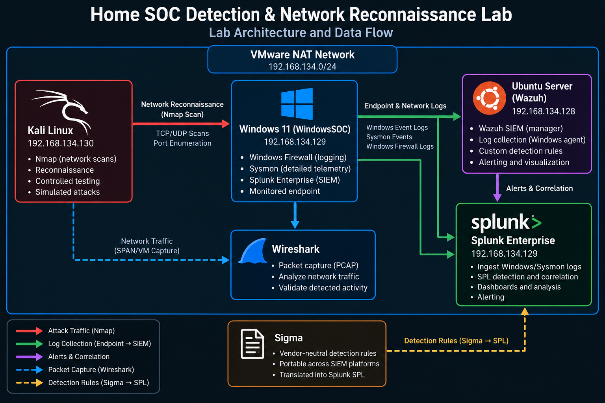
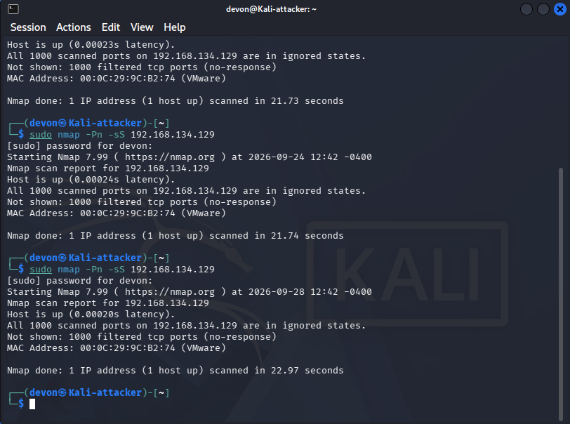
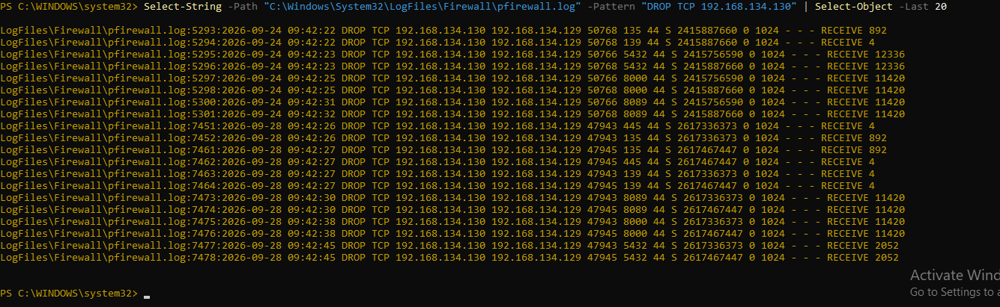
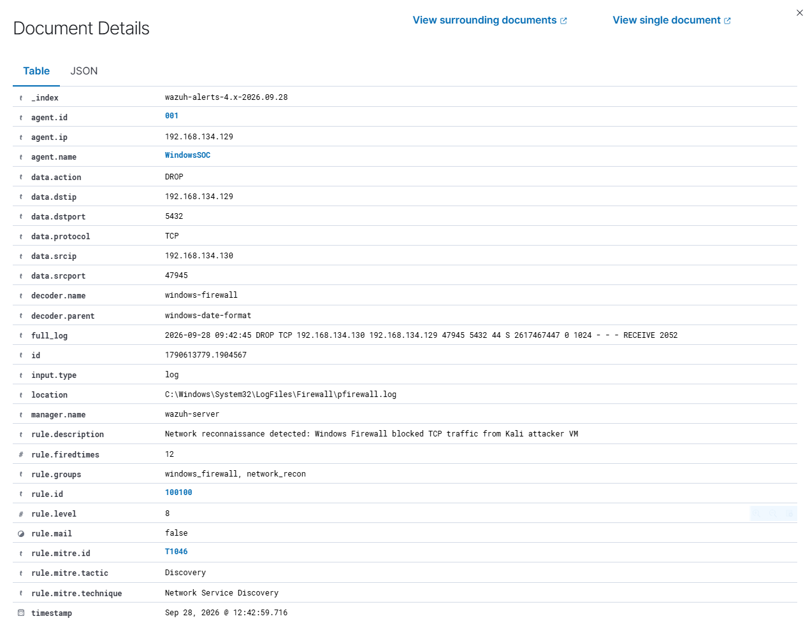
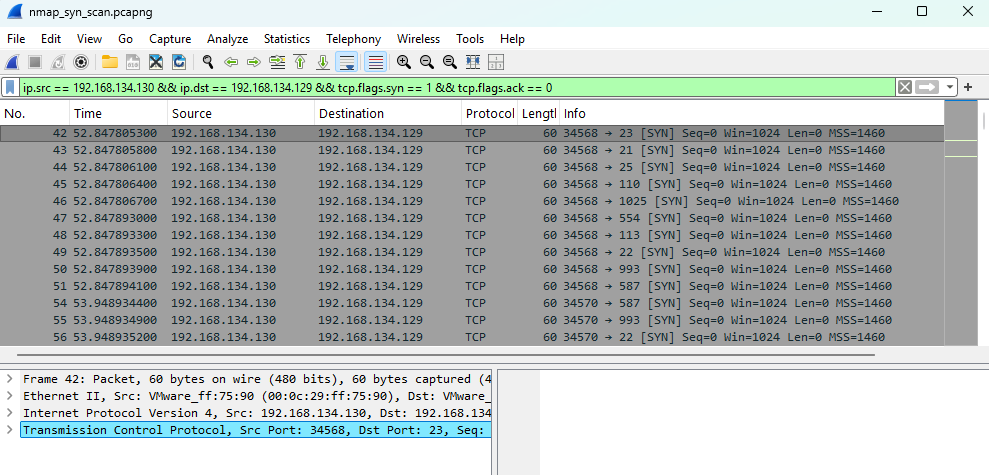
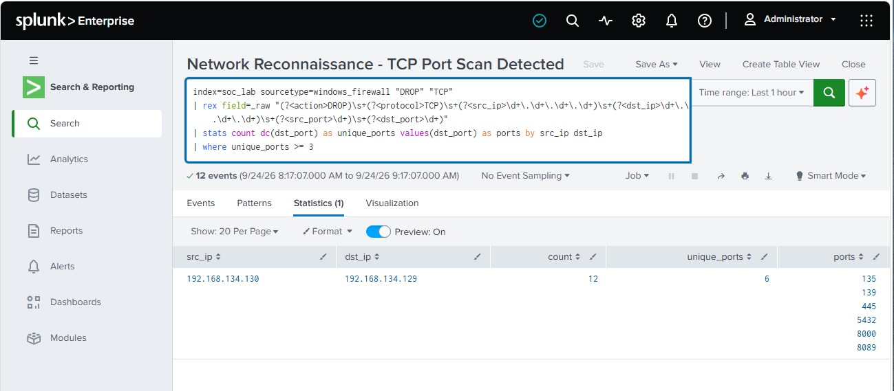
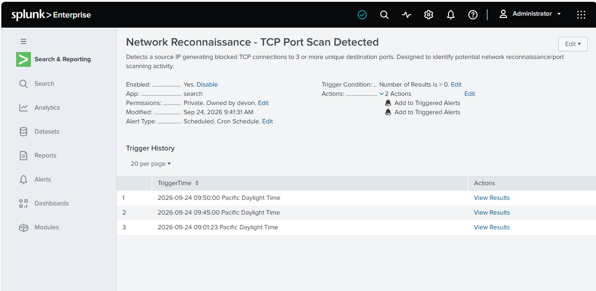
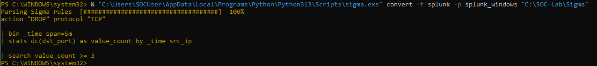

# Home SOC Detection & Network Reconnaissance Lab

A virtualized home SOC environment built to simulate, detect, and investigate network reconnaissance against a Windows endpoint.

This project demonstrates an end-to-end security monitoring and detection workflow using **Wazuh, Splunk Enterprise, Sysmon, Windows Firewall logging, Wireshark, Nmap, and Sigma**. Controlled reconnaissance was generated from a Kali Linux attacker VM and analyzed across multiple telemetry sources and SIEM platforms.

## Project Objectives

- Build a functional SOC lab using virtual machines and freely available security tools.
- Generate controlled network reconnaissance against a monitored Windows endpoint.
- Collect and analyze endpoint and network telemetry.
- Develop custom detections in Wazuh and Splunk.
- Correlate SIEM alerts with packet-level evidence in Wireshark.
- Map detected activity to the MITRE ATT&CK framework.
- Create vendor-neutral Sigma detection rules and translate them into Splunk SPL.
- Validate detections against real telemetry generated inside the lab.
  
## Lab Architecture

The lab was built in VMware Workstation using three virtual machines connected through a VMware NAT network.


| System | Role | IP Address |
|---|---|---|
| Kali Linux | Attacker / security testing system | 192.168.134.130 |
| Windows 11 | Monitored SOC endpoint | 192.168.134.129 |
| Ubuntu Server | Wazuh SIEM server | 192.168.134.128 |

### Security Stack

| Tool | Purpose |
|---|---|
| Wazuh | SIEM/XDR monitoring and custom detection |
| Splunk Enterprise | Log analysis, SPL detection, correlation, and alerting |
| Sysmon | Detailed Windows endpoint telemetry |
| Windows Firewall | Network connection and dropped-packet telemetry |
| Wireshark | Packet capture and network traffic validation |
| Nmap | Controlled network reconnaissance |
| Sigma | Vendor-neutral detection rules and correlation logic |

### Detection Artifacts

The custom detection logic developed for this project is included in the repository for review:

- [`detections/wazuh/windows_firewall_decoder.xml`](detections/wazuh/windows_firewall_decoder.xml) — Custom Wazuh decoder for parsing Windows Firewall dropped TCP traffic.
- [`detections/wazuh/network_recon_rule.xml`](detections/wazuh/network_recon_rule.xml) — Custom Wazuh reconnaissance detection mapped to MITRE ATT&CK T1046.
- [`detections/sigma/network_port_scan.yml`](detections/sigma/network_port_scan.yml) — Sigma base detection for blocked TCP traffic.
- [`detections/sigma/network_port_scan_correlation.yml`](detections/sigma/network_port_scan_correlation.yml) — Sigma correlation rule identifying connections to multiple destination ports within a defined time window.

## Detection Scenario: Network Reconnaissance

### Scenario Overview

To validate the monitoring and detection capabilities of the lab, I performed a controlled network reconnaissance exercise from the Kali Linux attacker VM against the Windows 11 endpoint.

An Nmap TCP SYN scan was generated from the Kali system (`192.168.134.130`) targeting the Windows endpoint (`192.168.134.129`). The Windows Firewall blocked the inbound connection attempts and recorded the activity in its firewall log.

The resulting telemetry was analyzed across multiple layers of the lab:

- **Windows Firewall** recorded the blocked TCP connection attempts.
- **Wazuh** ingested the firewall telemetry and generated a custom reconnaissance detection.
- **Wireshark** provided packet-level validation of the scan traffic.
- **Splunk Enterprise** was used to search, extract, correlate, and analyze the firewall events.
- **Sigma** was used to create vendor-neutral detection logic and translate the detection into Splunk SPL.
- The activity was mapped to **MITRE ATT&CK T1046 – Network Service Discovery**.

### 1. Reconnaissance Generation

Network reconnaissance was generated from the Kali Linux attacker VM using Nmap. A TCP SYN scan targeted the Windows 11 endpoint:

```bash
sudo nmap -Pn -sS 192.168.134.129
```

The scan probed the Windows endpoint for accessible TCP services. The Windows Firewall filtered the probes, resulting in Nmap reporting the scanned ports as filtered/no-response.

#### Nmap Scan Evidence



*Figure 1 — Controlled TCP SYN reconnaissance performed from the Kali Linux attacker VM against the monitored Windows 11 endpoint. The target remained reachable while the Windows Firewall filtered the scanned TCP ports.*

### 2. Windows Firewall Telemetry

The Windows 11 endpoint was configured to log dropped network connections through Windows Defender Firewall. Following the Nmap SYN scan, the firewall log recorded repeated TCP connection attempts originating from the Kali Linux attacker VM (`192.168.134.130`) and targeting the monitored Windows endpoint (`192.168.134.129`).

The log entries show the firewall dropping TCP traffic across multiple destination ports, providing host-level evidence of the reconnaissance activity.

#### Firewall Log Evidence



*Figure 2 — Windows Firewall telemetry showing dropped TCP connection attempts from the Kali Linux attacker VM (`192.168.134.130`) to the monitored Windows 11 endpoint (`192.168.134.129`).*

### 3. Wazuh Detection

Windows Firewall telemetry was ingested by the Wazuh agent running on the Windows 11 endpoint. A custom decoder was used to parse the firewall log and extract fields including the source IP, destination IP, source port, destination port, protocol, and firewall action.

A custom Wazuh detection rule was then created to identify blocked TCP traffic originating from the Kali Linux attacker VM. The rule generated a **Level 8 alert** when the reconnaissance traffic was detected.

Key detection details:

- **Rule ID:** `100100`
- **Rule Level:** `8`
- **Source IP:** `192.168.134.130` (Kali Linux)
- **Destination IP:** `192.168.134.129` (WindowsSOC)
- **Protocol:** TCP
- **Firewall Action:** DROP
- **Decoder:** `windows-firewall`
- **MITRE ATT&CK:** `T1046`
- **Tactic:** Discovery

#### Wazuh Detection Evidence



*Figure 3 — Wazuh custom detection triggered by blocked TCP reconnaissance traffic from the Kali Linux attacker VM. The alert identifies the source and destination systems, firewall action, custom rule, severity level, and MITRE ATT&CK mapping.*

### 4. Wireshark Packet Analysis

Wireshark was used on the Windows 11 endpoint to validate the reconnaissance activity at the packet level. The capture was filtered to isolate TCP SYN packets originating from the Kali Linux attacker VM (`192.168.134.130`) and targeting the Windows endpoint (`192.168.134.129`).

The following display filter was applied:

```text
ip.src == 192.168.134.130 && ip.dst == 192.168.134.129 && tcp.flags.syn == 1 && tcp.flags.ack == 0
```

The capture shows repeated TCP SYN packets targeting multiple destination ports, including ports 21, 22, 23, 25, 110, 113, 554, 993, and 1025. This packet-level evidence confirms the port-scanning behavior observed in the Windows Firewall telemetry and subsequently detected by Wazuh.

#### Wireshark Packet Evidence



*Figure 4 — Wireshark capture showing TCP SYN probes from the Kali Linux attacker VM (`192.168.134.130`) to multiple ports on the monitored Windows 11 endpoint (`192.168.134.129`).*

### 5. Splunk Detection and Alerting

Windows Firewall telemetry was also ingested into Splunk Enterprise to demonstrate detection and investigation of the same reconnaissance activity across a second SIEM platform.

Splunk SPL was used to parse the firewall events, extract the source and destination IP addresses and ports, and correlate repeated blocked TCP connections. The detection identified the Kali Linux attacker VM (`192.168.134.130`) communicating with the Windows 11 endpoint (`192.168.134.129`) across multiple destination ports.

The detection search identified **12 blocked TCP events across 6 unique destination ports**, providing an additional correlation of the reconnaissance activity previously observed in Wireshark and Wazuh.

#### Splunk Detection Evidence



*Figure 5 — Splunk SPL detection correlating blocked TCP connections from the Kali Linux attacker VM and identifying multiple destination ports associated with reconnaissance activity.*

The detection logic was then operationalized as a scheduled Splunk alert named **Network Reconnaissance - TCP Port Scan Detected**. The alert was configured to trigger when the search returned activity meeting the port-scan detection criteria.

#### Splunk Alert Evidence



*Figure 6 — Splunk scheduled alert for network reconnaissance showing successful trigger history after detecting the simulated TCP port scan.*

### 6. Sigma Detection Engineering

To express the reconnaissance detection in a portable, SIEM-agnostic format, Sigma was used to define detection logic for the Windows Firewall telemetry.

The Sigma correlation logic identifies dropped TCP connections and groups the activity into five-minute windows. It then counts the number of distinct destination ports contacted by each source IP. Activity involving **3 or more unique destination ports** within the time window meets the detection threshold.

The Sigma rule was validated using Sigma CLI and then converted to Splunk SPL using the Splunk Windows processing pipeline. This demonstrates how platform-independent detection logic can be translated into SIEM-specific queries.

The generated Splunk correlation logic included:

```text
action="DROP" protocol="TCP"
| bin _time span=5m
| stats dc(dst_port) as value_count by _time src_ip
| search value_count >= 3
```

This converted query preserves the core detection behavior of the Sigma correlation: identifying a source generating blocked TCP connections across multiple destination ports within a defined time window.

#### Sigma Conversion Evidence



*Figure 7 — Sigma correlation rule converted into Splunk SPL, demonstrating translation of vendor-neutral detection logic into SIEM-specific correlation logic.*

### 7. Investigation Summary

This project demonstrated an end-to-end detection engineering and SOC investigation workflow using a controlled network reconnaissance scenario within a virtualized home lab.

A Kali Linux attacker VM generated TCP SYN reconnaissance traffic against a monitored Windows 11 endpoint. The activity was examined across multiple layers of the environment, allowing the same behavior to be validated through network traffic, endpoint telemetry, SIEM detections, and portable detection logic.

The investigation followed this workflow:

**Kali Linux / Nmap → Wireshark → Windows Defender Firewall → Wazuh → Splunk → Sigma**

1. **Nmap** generated controlled TCP SYN reconnaissance traffic from the Kali Linux attacker VM.
2. **Wireshark** captured the traffic and confirmed repeated SYN probes targeting multiple TCP destination ports.
3. **Windows Defender Firewall** blocked the connection attempts and recorded the activity in the endpoint firewall log.
4. **Wazuh** ingested the firewall telemetry, parsed the events with a custom decoder, and generated a custom Level 8 reconnaissance alert mapped to MITRE ATT&CK T1046.
5. **Splunk Enterprise** independently ingested and correlated the firewall events using SPL, identifying repeated blocked connections across multiple destination ports and operationalizing the detection as a scheduled alert.
6. **Sigma** was used to express the detection logic in a vendor-neutral format and convert the correlation logic into Splunk SPL.

### Key Outcomes

The completed scenario demonstrates hands-on experience with:

- Network traffic generation and reconnaissance using Nmap
- Packet-level investigation using Wireshark
- Windows Firewall telemetry collection and analysis
- SIEM log ingestion and event parsing
- Custom Wazuh decoder and detection rule development
- MITRE ATT&CK mapping
- Splunk SPL development and event correlation
- Scheduled SIEM alert creation and validation
- Sigma detection engineering and SIEM query conversion
- Cross-tool validation of security telemetry

Rather than relying on a single detection source, the activity was validated across multiple layers of telemetry. This provided a complete evidence chain from the original network traffic through endpoint logging, SIEM detection, correlation, and portable detection engineering.
